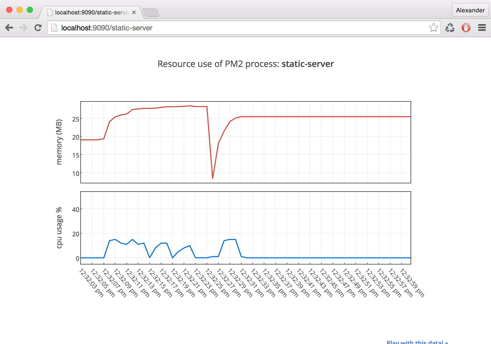

# pm2-plotly
Create a quick dashboard to monitor [pm2](https://www.npmjs.com/package/pm2) apps using Plotly



## install
```bash
npm install -g pm2-plotly
```

## configure with your Plotly credentials
```bash
touch ~/.pm2_plotly
```

Fill that file with your credentials:
```json
{
    "username": "alexander.daniel",
    "apiKey": "xxxxxxxxxxx",
    "tokens": [
        "xxxxxxxxxxx",
        "xxxxxxxxxxx"
    ]
}
```

Now you're ready to go!

## start the dashboard server:
```bash
pm2-plotly
```

Visiting `http://localhost:9090/` will show you a list of running pm2 apps.

Right now you can only view one at a time, as this script only uses 2 plotly streamTokens. Feel free to fork!

# license
MIT
